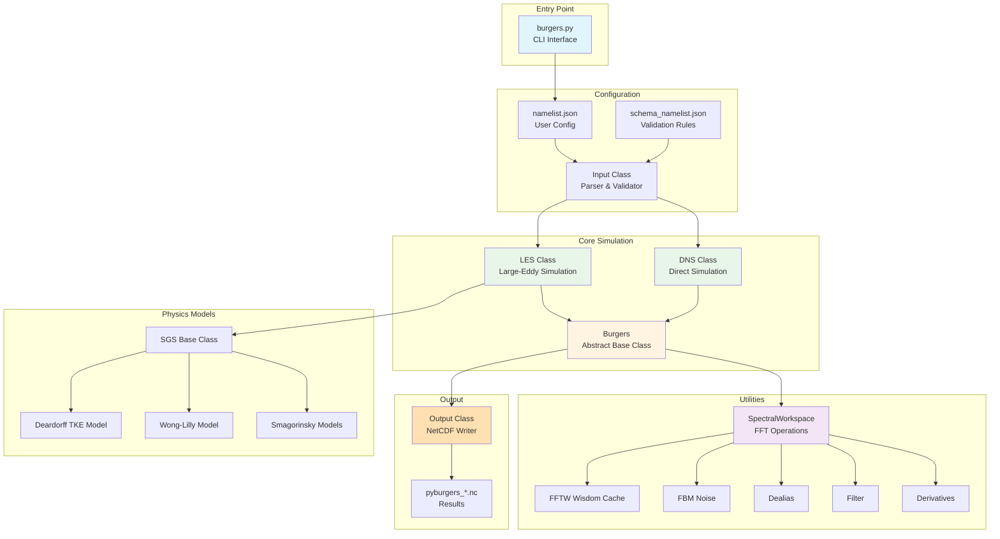
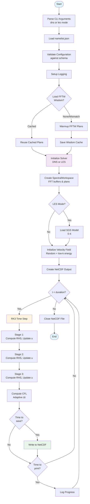
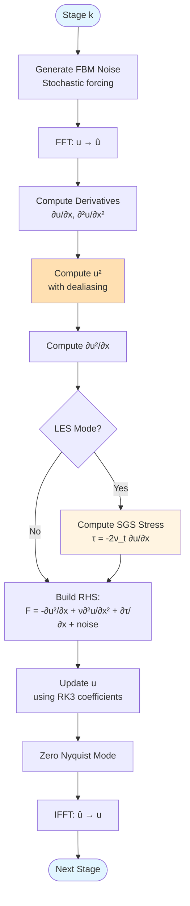
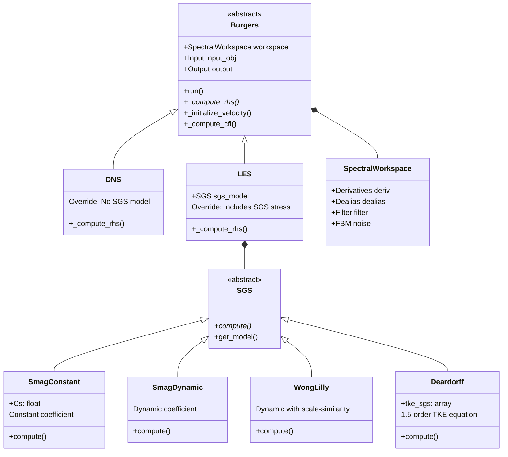
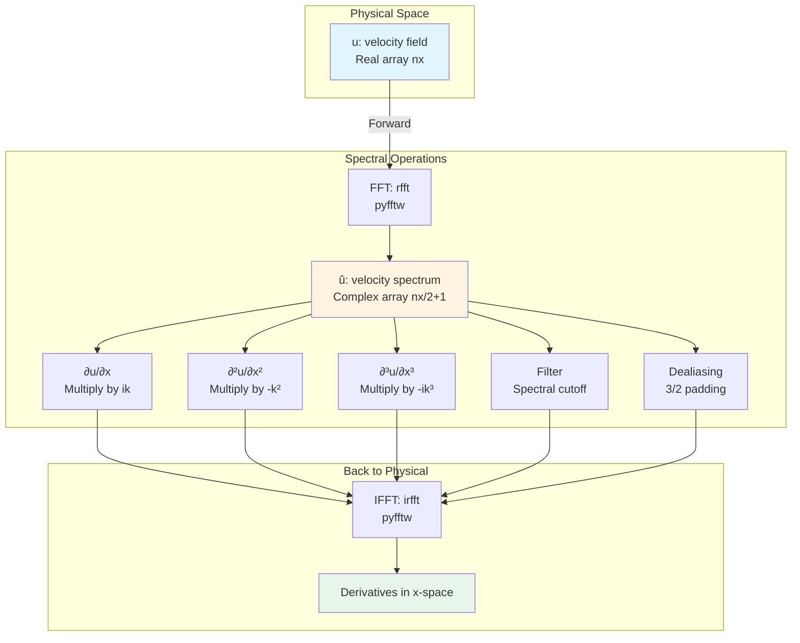
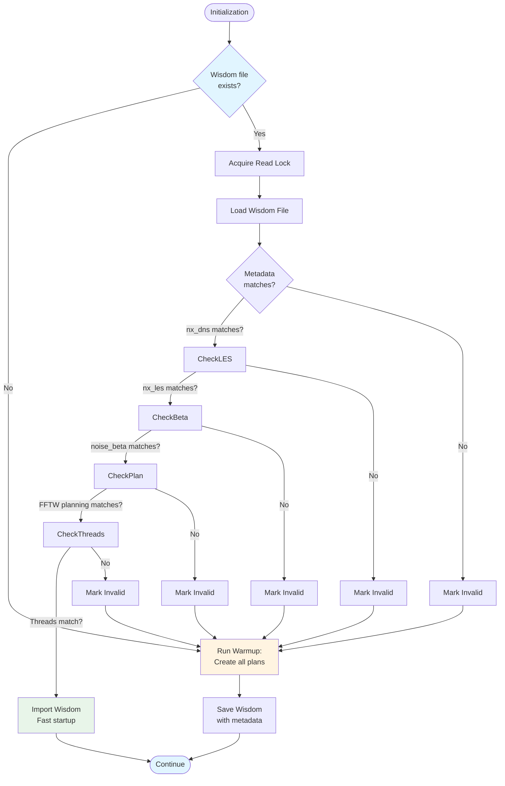
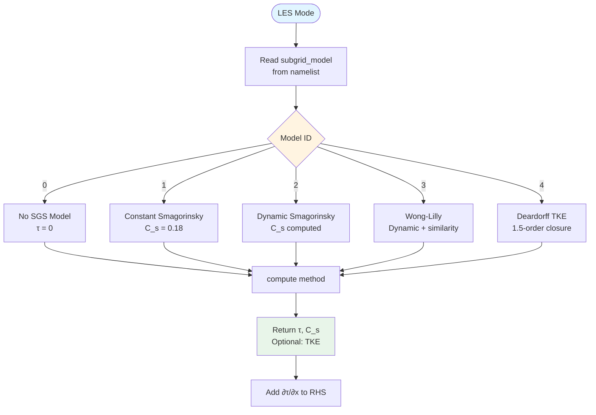

# Architecture

This page provides visual diagrams showing how PyBurgers is structured and how the simulation flows from start to finish.

## High-Level Architecture

## Simulation Execution Flow

## RK3 Stage Details

Each Runge-Kutta stage computes the right-hand side (RHS) of the Burgers equation:

## Class Hierarchy

## Data Flow in SpectralWorkspace

## FFTW Wisdom Caching Strategy

## SGS Model Selection

## Key Design Patterns

### Abstract Base Class Pattern
- `Burgers` defines common interface and time-stepping logic
- `DNS` and `LES` implement mode-specific RHS computation
- Eliminates code duplication while allowing specialization

### Factory Pattern
- `SGS.get_model()` creates appropriate SGS model instance
- Centralizes model selection logic
- Easy to add new SGS models

### Workspace Pattern
- `SpectralWorkspace` bundles all spectral operations
- Pre-allocates FFTW buffers for efficiency
- Provides clean interface to complex FFT operations

### Caching Pattern
- FFTW wisdom stored with metadata validation
- First run: slow planning, subsequent runs: instant
- Automatic invalidation on parameter changes
